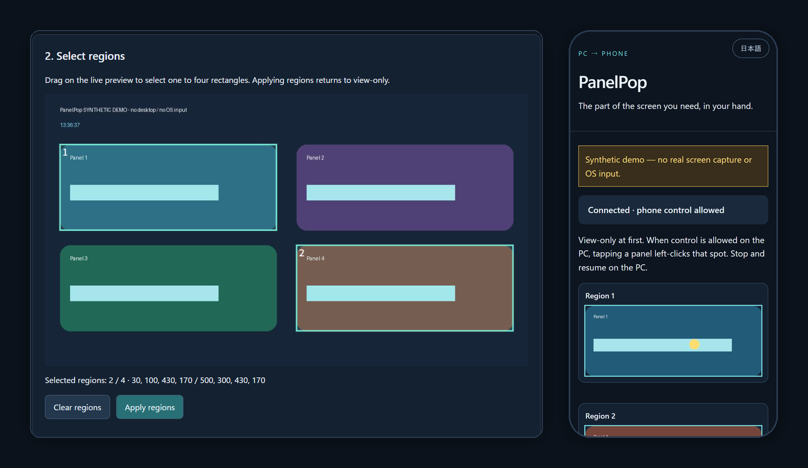

# PanelPop

[](https://github.com/anpanmanj987-hub/PanelPop/actions/workflows/ci.yml)
[](LICENSE)


**Put just the part of a Windows app you need on your phone.**

PanelPop crops one to four regions out of a Windows window and streams them live to a phone browser on the same Wi-Fi. When you allow it on the PC, a tap on the phone becomes a left click at that spot. Nothing to install on the phone, and no cloud.

[日本語 README](README.md)



<sub>Screenshots use the synthetic `--demo` mode; no real desktop is shown.</sub>

## Good for

- Watching a long build or render progress bar from another room
- Keeping only the record button of a capture tool, or one dashboard chart, at hand
- Glancing at part of a PC screen in another room from your phone

## Features

- **Only the regions you need**: drag up to four rectangles instead of mirroring the whole window.
- **View-only by default**: taps work only after you allow phone control on the PC. Stop, resume and permission changes are PC-only.
- **Guards against misclicks**: every frame expires after two seconds; moving, resizing, minimizing or covering the window pauses the session, and it never resumes on its own; the cursor position is read back right before clicking.
- **Stays local**: no external servers, CDNs or analytics. URLs carry a secret token generated at each launch.
- **English and Japanese**: the interface and messages follow your browser language; switch any time with the button at the top right.
- **Two dependencies**: Pillow and qrcode.

## Quick start

Requires Windows 10/11 and Python 3.10 or newer. In PowerShell:

```powershell
py -m venv panelpop-env
panelpop-env\Scripts\python -m pip install https://github.com/anpanmanj987-hub/PanelPop/archive/refs/tags/v0.1.0a4.zip
panelpop-env\Scripts\python -m panelpop --demo --open
```

`--demo` uses generated images only: it never captures the screen or sends OS input, and it also runs on macOS and Linux. The PC settings page opens in your browser; drag regions on the preview and apply them.

Drop `--demo` to use real windows. For a phone, explicitly enable LAN listening with this PC's private IPv4 address (the "IPv4 Address" line of `ipconfig`):

```powershell
panelpop-env\Scripts\python -m panelpop --lan --advertise 192.168.1.20 --open
```

Replace `192.168.1.20` with your PC's address. Put the PC and phone on the same trusted Wi-Fi. If Windows Firewall asks, allow TCP 8765 on private networks only.

## How to use

1. On the PC settings page, pick the target window and show its preview. Place the settings browser and the target side by side so they do not overlap.
2. Drag one to four regions on the preview and apply them.
3. Scan the QR code with your phone. Panels update live in view-only mode.
4. To control the PC, enable phone control on the PC. Tapping a panel left-clicks that spot on the PC.
5. The always-visible Stop button halts both display and input. Resume on the PC; resuming returns to view-only. `Ctrl+C` shuts the host down.

Any change to the window's position, size, process or visibility, or an overlapping window, pauses the session. Restoring the window does not resume it: resume on the PC or select the target again.

## Safety design

- Separate PC-admin and viewer tokens. Admin APIs accept loopback connections only, so a phone cannot configure, resume or grant control.
- Taps on stale or unknown frames and out-of-range coordinates are refused. A network failure clears the panels and never reports success.
- Occlusion checks are conservative: transparent windows and pop-ups above the target count as covering it. Cloaked windows that Windows never draws are ignored.
- After moving the cursor, PanelPop reads its real position back and refuses to click if it differs.

## Limitations

- LAN traffic is unencrypted HTTP. Use a trusted network only and never expose the port to the internet. Restarting the host revokes leaked URLs or QR codes.
- Checks and the click are not atomic; a change right after the last check can still misdirect a click. Do not use PanelPop for safety-critical operations.
- Left click only: no scrolling, keyboard input or long press. Windows UIPI can block clicks into elevated (administrator) apps.
- Targets up to 16 million pixels (8192 px per edge) and four regions. Protected video may not be capturable.

## Verification status

- **Automated tests**: 44 cases, run by GitHub Actions on Windows and Linux with Python 3.10, 3.12 and 3.14.
- **Real Windows**: on 2026-10-06, Windows 11 at 150% display scaling with Python 3.14.8: capture and cropping of a real window, a tap turning into a real click, and refusal of taps on expired frames, while stopped and after the window moved.
- **Not yet verified**: real phones over a real LAN, multiple or mixed-DPI monitors, elevated target apps.

See the [validation record](docs/VALIDATION.md) and [design notes](docs/DESIGN.md).

## Development

```sh
git clone https://github.com/anpanmanj987-hub/PanelPop.git
cd PanelPop
python -m pip install -e . build
python -m unittest discover -s tests -v
python -m build
```

Bug reports and ideas are welcome in [Issues](https://github.com/anpanmanj987-hub/PanelPop/issues). See the [changelog](CHANGELOG.md).

## License

[MIT](LICENSE)
