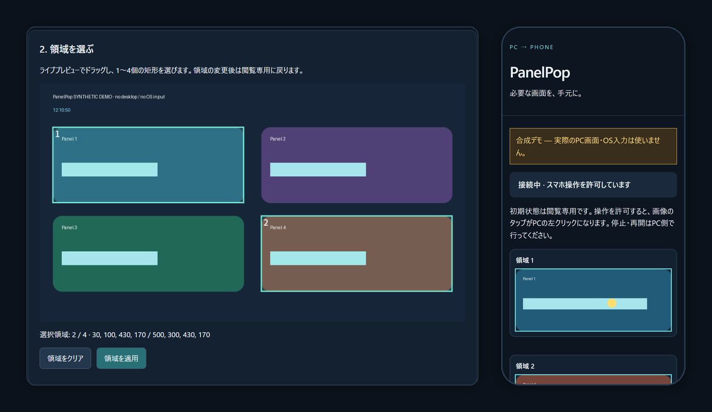

# PanelPop

[](https://github.com/anpanmanj987-hub/PanelPop/actions/workflows/ci.yml)
[](LICENSE)


**Windowsのアプリ画面の「必要な部分だけ」を、スマホに。**

PanelPop は、Windowsのウィンドウから1〜4個の領域を切り出して、同じWi-Fiにつないだスマホのブラウザにライブ表示するツールです。PCで許可したときだけ、スマホでのタップをその位置の左クリックとしてPCに送ります。スマホへのアプリのインストールも、クラウドも使いません。

[English README](README.en.md)



<sub>画面は `--demo` で動かした合成デモです。実際のデスクトップは映していません。</sub>

## こんなときに

- 時間のかかるビルドやレンダリングの進捗を、席を離れて確認する
- 録画ソフトの「開始」ボタンや監視ダッシュボードのグラフだけを手元に置く
- 別の部屋にあるPCの画面の一部を、スマホから見る

## 特長

- **必要な領域だけを表示**：ウィンドウ全体ではなく、ドラッグで選んだ矩形（最大4つ）だけを送ります。
- **最初は閲覧専用**：タップ操作はPCで「スマホ操作を許可」を選んだときだけ有効になります。停止・再開・許可の切り替えはPCからしかできません。
- **誤クリックを防ぐ仕組み**：表示中の画像は2秒で失効します。ウィンドウの移動・リサイズ・最小化や、他のウィンドウとの重なりを検出すると自動で停止し、自動では再開しません。クリック直前にもカーソル位置を再確認します。
- **ローカルで完結**：外部サーバー、CDN、解析ツールは使いません。接続URLには起動ごとに生成する秘密トークンが含まれます。
- **依存は2つだけ**：Pillow と qrcode です。

## クイックスタート

Windows 10/11 と Python 3.10 以上が必要です。PowerShell で実行します。

```powershell
py -m venv panelpop-env
panelpop-env\Scripts\python -m pip install https://github.com/anpanmanj987-hub/PanelPop/archive/refs/tags/v0.1.0a3.zip
panelpop-env\Scripts\python -m panelpop --demo --open
```

`--demo` は合成画像だけを使う動作確認モードです。PCの画面は撮影せず、OSへの入力も送りません（macOS・Linuxでも動きます）。PC設定画面がブラウザで開くので、プレビューから領域をドラッグして選び、「領域を適用」を押してください。

実際のウィンドウを使うときは `--demo` を外します。スマホから接続するには、PCのLAN内IPv4アドレス（`ipconfig` の「IPv4 アドレス」）を指定して、LANでの待ち受けを明示的に有効にします。

```powershell
panelpop-env\Scripts\python -m panelpop --lan --advertise 192.168.1.20 --open
```

`192.168.1.20` は例です。自分のPCのアドレスに置き換えてください。PCとスマホは同じ信頼できるWi-Fiに接続します。Windowsファイアウォールの確認が出たら、プライベートネットワークでのみTCP 8765を許可してください。

## 使い方

1. PC設定画面で対象のウィンドウを選び、「プレビューを表示」を押します。設定画面のブラウザと対象のウィンドウは、重ならないように並べてください。
2. プレビュー上をドラッグして1〜4個の領域を選び、「領域を適用」を押します。
3. 設定画面のQRコードをスマホで読み取ります。最初は閲覧専用でライブ表示されます。
4. 操作もしたいときは、PCで「スマホ操作を許可」をオンにします。スマホの画像をタップすると、その位置がPCで左クリックされます。
5. 画面下に常に表示される「停止」で、表示と操作をすぐに止められます。再開もPCで行い、再開後はまた閲覧専用に戻ります。終了は `Ctrl+C` です。

ウィンドウの位置・サイズ・プロセス・表示状態が変わったり、他のウィンドウに遮られたりすると停止します。元に戻しても自動では再開しないので、PCで「PCで再開」を押すか、対象と領域を選び直してください。

## 安全のための設計

- PC設定用と閲覧用のトークンは別々です。PC設定のAPIはループバック（同じPC）からの接続しか受け付けないため、スマホから設定・再開・操作許可の変更はできません。
- 古いフレームや不明なフレームからの操作、領域外や不正な座標の操作は拒否します。通信に失敗した場合は画像を消し、成功とは表示しません。
- 他のウィンドウとの重なりは保守的に判定します。透明なウィンドウやポップアップが重なっている場合も拒否することがあります（画面に描画されないクローク状態のウィンドウは除外します）。
- カーソルを移動した直後に実際の位置を読み取り、指定位置と一致しない場合はクリックせずに停止します。

## 制限事項

- LAN内の通信は暗号化されないHTTPです。信頼できるネットワークだけで使い、インターネットには公開しないでください。URLやQRコードが漏れたときは、ホストを再起動すれば無効になります。
- 安全確認とクリックの間は原子的ではありません。確認の直後に画面が変わると誤操作が起こり得るため、安全上重要な操作には使わないでください。
- 対応する操作は左クリックだけです。スクロール、キーボード入力、長押しには対応していません。管理者権限で動くアプリへのクリックは、WindowsのUIPIによって拒否されることがあります。
- 対象ウィンドウは最大1600万画素（各辺8192px以下）、領域は最大4つです。著作権保護された映像などは撮影できない場合があります。

## 動作確認の状況

- **自動テスト**：34件。GitHub ActionsでWindows・Linux × Python 3.10 / 3.12 / 3.14 を実行しています。
- **Windows実機**：2026年10月6日に、Windows 11（表示スケール150%）とPython 3.14.8で、実際のウィンドウに対する画面取得・領域の切り出し・タップによるクリック、そして期限切れ・停止中・ウィンドウ移動後のタップが拒否されることを確認しました。
- **未確認**：実際のスマートフォンとLAN経由での接続、複数モニターやDPIの異なるモニターの組み合わせ、管理者権限のアプリ。

詳しくは [検証記録](docs/VALIDATION.md) と [設計メモ](docs/DESIGN.md) を参照してください。

## 開発

```sh
git clone https://github.com/anpanmanj987-hub/PanelPop.git
cd PanelPop
python -m pip install -e . build
python -m unittest discover -s tests -v
python -m build
```

不具合の報告や改善の提案は [Issues](https://github.com/anpanmanj987-hub/PanelPop/issues) へお願いします。変更履歴は [CHANGELOG](CHANGELOG.md) にあります。

## ライセンス

[MIT](LICENSE)
